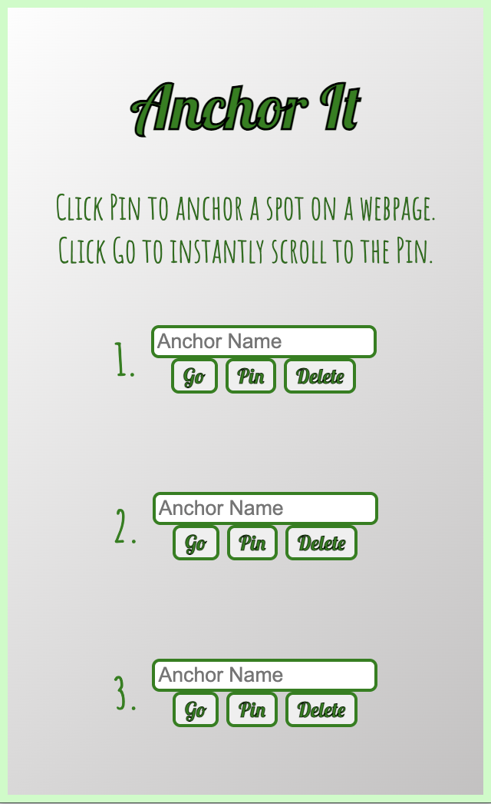
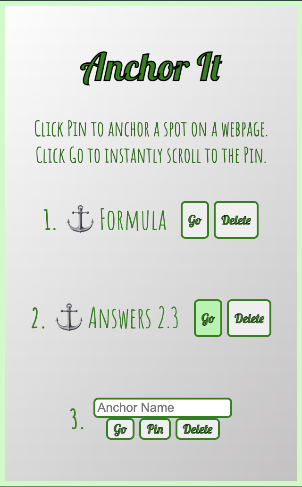

# ⚓️ Anchor It
Anchor It lets you save up to 3 scroll positions on any webpage and jump back to them instantly. Perfect for long articles, documentation, research, and reviews.

## 🧑‍🔧 Problem & Solution
**Problem:** I always had the problem of going through long papers, textbooks, or articles and needing to go back to the spot I scrolled away from constantly. 

**Solution:** An application that lets you save named scroll positions and jump back to them instantly.

## 🤩 Features
- Save up to 3 scroll positions per webpage
- Jump back to any saved position instantly
- Clean, minimal popup interface
- All data stored locally

## 🏛️ Architecture Overview
- Chrome Extension (Manifest V3)
- Content scripts for scroll handling
- Popup UI with message passing (HTML, CSS, JavaScript)
- chrome.storage.local for persistence

## 📝 Demo Instructions
- TODO: Chrome extension under review (will add link once approved)

## 🧑‍🔧 How to Use
1. Open any standard webpage and scroll
2. Click the Anchor It extension
3. Enter a name and click Save
4. Click Go to jump back
5. Click Delete to remove the anchor

## 📸 Preview
<p align="center">
  
  
</p>

## Project Structure
```bash
Anchor-It/
├── assets/                 # Extension icons
│   ├── icon16.png
│   ├── icon32.png
│   ├── icon48.png
│   └── icon128.png
├── docs/
│   └── specs.md            # Technical specifications and design notes
├── screenshots/
│   ├── Empty_State.png     # Popup UI before any anchors are saved
│   └── Full_State.png      # Popup UI after an anchor is saved
├── src/
│   ├── content/
│   │   └── content.js      # Content script for reading and restoring scroll positions
│   └── popup/
│       ├── popup.html      # Popup UI markup
│       ├── popup.css       # Popup UI styling
│       └── popup.js        # Popup logic and message handling
├── manifest.json           # Chrome extension configuration
├── PRIVACY.md              # Privacy policy
├── LICENSE                 # MIT license
└── README.md               # This file
```

## 🚫 Limitations
- Does not work on Chrome internal pages (chrome://)
- Some sites with custom scroll containers may not be supported

## 🪪 License
This project is open source and available under the MIT License